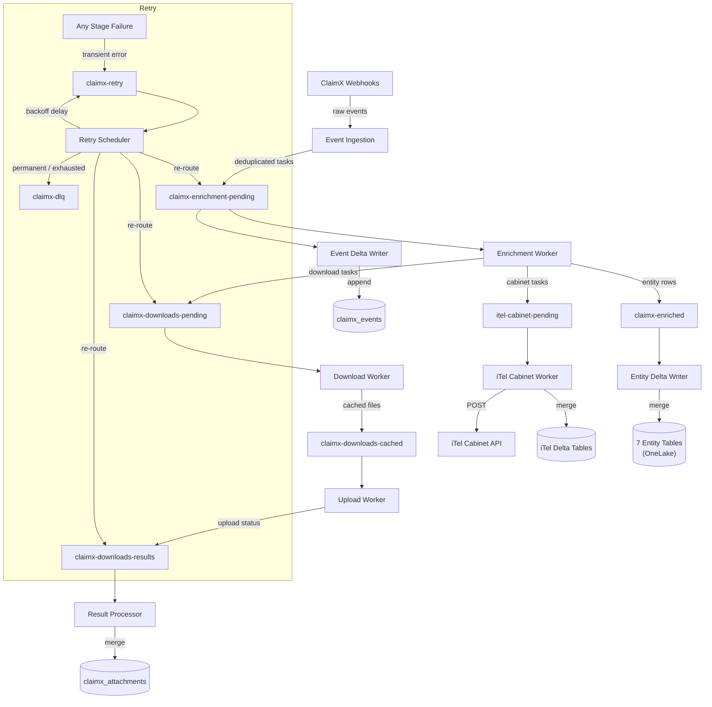

# ClaimX-to-iTel Pipeline Overview

The ClaimX pipeline is an event-driven data pipeline that ingests webhook events from ClaimX (Verisk), enriches them with API data, downloads and stores attachments on OneLake, and writes structured entity data to Delta Lake tables. A specialized integration routes kitchen cabinet repair tasks to the iTel Cabinet API for vendor processing.

---

## Architecture

---

## Pipeline Stages

### 1. Event Ingestion

| | |
|---|---|
| **Trigger** | ClaimX sends webhook events to the `claimxperience` EventHub (external) |
| **Output** | `claimx-enrichment-pending` topic |

The ingester consumes raw webhook events, parses them into structured messages, and deduplicates using a **hybrid strategy**: an in-memory LRU cache (100k entries) backed by persistent Azure Blob storage (24-hour TTL). Duplicate detection uses a deterministic SHA-256 trace ID derived from a composite key (project ID, event type, timestamp, media/task/video IDs, master file name). Intra-batch dedup catches duplicates within the same message batch.

The worker auto-detects backfill vs. realtime mode based on event age, adjusting batch sizes accordingly (2,000 for backfill, 100 for realtime).

**Event types handled:** `PROJECT_CREATED`, `PROJECT_FILE_ADDED`, `PROJECT_MFN_ADDED`, `CUSTOM_TASK_ASSIGNED`, `CUSTOM_TASK_COMPLETED`, `POLICYHOLDER_INVITED`, `POLICYHOLDER_JOINED`, `VIDEO_COLLABORATION_INVITE_SENT`, `VIDEO_COLLABORATION_COMPLETED`, `PROJECT_AUTO_XA_LINKING_UNSUCCESSFUL`

---

### 2. Enrichment

| | |
|---|---|
| **Trigger** | Messages on `claimx-enrichment-pending` |
| **Output** | `claimx-enriched` (entity rows), `claimx-downloads-pending` (download tasks), `itel-cabinet-pending` (cabinet repair tasks) |

The enrichment worker routes each event to a **handler** based on event type. Each handler calls the ClaimX API (1-3 calls) to fetch full entity data, then extracts structured rows for up to 7 entity types.

| Event Type | Handler | Entities Produced |
|---|---|---|
| `PROJECT_CREATED` | ProjectHandler | projects, contacts |
| `PROJECT_MFN_ADDED` | ProjectHandler | projects |
| `PROJECT_FILE_ADDED` | MediaHandler | media |
| `CUSTOM_TASK_ASSIGNED` / `COMPLETED` | TaskHandler | tasks, task_templates, external_links, contacts |
| `POLICYHOLDER_INVITED` / `JOINED` | ProjectUpdateHandler | projects |
| `VIDEO_COLLABORATION_*` | VideoCollabHandler | video_collab, projects |
| `PROJECT_AUTO_XA_LINKING_UNSUCCESSFUL` | ProjectUpdateHandler | projects |

API calls use local retries (3 attempts, exponential backoff). A project cache avoids redundant API calls for already-verified projects.

---

### 3. Entity Delta Writes

| | |
|---|---|
| **Trigger** | Messages on `claimx-enriched` |
| **Output** | 7 Delta tables on OneLake |

Consumes entity row batches and writes them to Delta Lake using idempotent **MERGE** operations. Rows are batched (100 rows / 30s timeout) before writing.

| Table | Merge Key | Partitioned By |
|---|---|---|
| `claimx_projects` | project_id | project_id |
| `claimx_contacts` | project_id + contact_email | project_id |
| `claimx_attachment_metadata` | media_id | project_id |
| `claimx_tasks` | assignment_id | project_id |
| `claimx_task_templates` | task_id | — |
| `claimx_external_links` | link_id | project_id |
| `claimx_video_collab` | video_collaboration_id | — |

---

### 4. Event Delta Writes

| | |
|---|---|
| **Trigger** | Messages on `claimx-enrichment-pending` (parallel consumer) |
| **Output** | `claimx_events` Delta table |

A separate consumer on the same enrichment-pending topic writes every deduplicated event to an audit log table. This runs in parallel with enrichment and captures the complete event history.

| Table | Key Columns | Partitioned By |
|---|---|---|
| `claimx_events` | trace_id, event_type, project_id, media_id, task_assignment_id, etc. | event_date |

---

### 5. Download

| | |
|---|---|
| **Trigger** | Messages on `claimx-downloads-pending` |
| **Output** | `claimx-downloads-cached` topic |

Downloads media files using S3 presigned URLs extracted during enrichment. Runs up to 10 concurrent downloads. Large files (>100 MB) use range-based downloads. Files are saved to a local cache directory organized by project and media ID.

---

### 6. Upload

| | |
|---|---|
| **Trigger** | Messages on `claimx-downloads-cached` |
| **Output** | `claimx-downloads-results` topic |

Uploads cached files from local disk to OneLake (`Files/pcesdopodapp/claimx/attachments/{project_id}/media/{file_name}`). Runs up to 10 concurrent uploads. Local cache files are deleted after successful upload.

---

### 7. Result Processing

| | |
|---|---|
| **Trigger** | Messages on `claimx-downloads-results` |
| **Output** | `claimx_attachments` Delta table |

Accumulates upload results in batches (500 results / 5s timeout) and writes a final attachment inventory to Delta Lake, tracking media_id, upload status, error messages, and timestamps.

---

## iTel Cabinet Integration

The iTel integration is a standalone worker that processes kitchen cabinet repair assessments from ClaimX and submits them to the iTel Cabinet API.

### Trigger

During enrichment, tasks matching specific task IDs (32615, 24454) are checked for a "Kitchen cabinet damage present" = "Yes" form answer. Qualifying tasks are published to the `itel-cabinet-pending` topic.

### Processing Flow

1. **Consume** — The iTel tracking worker picks up the task event
2. **Enrich** (completed tasks only) — Makes 3 ClaimX API calls:
   - `GET /customTasks/assignment/{id}?full=true` — full form data
   - `GET /export/project/{id}/media` — media URLs (resolved to S3 presigned URLs)
   - `GET /export/project/{id}` — insured/customer information
   - Adjuster info is extracted from a specific form group within the assignment
3. **Parse** — Extracts structured cabinet damage data (4 cabinet types x damage attributes), attachment metadata, and a human-readable report organized by topic
4. **Write to Delta** — Merges parsed data into two tables:
   - `claimx_itel_forms` (merge on assignment_id) — form submissions
   - `claimx_itel_attachments` (merge on assignment_id + media_id) — media attachments
5. **Submit to iTel API** — Transforms the payload to iTel's vendor format (cabinet specs, linear feet, insured/adjuster info, categorized images) and POSTs via OAuth2-authenticated API call
6. **Record result** — Publishes success/error to output topics and archives the result JSON to OneLake

---

## Retry & Error Handling

All pipeline stages share a unified retry architecture.

**Error classification:**

| Category | Examples | Action |
|---|---|---|
| **Transient** | Timeouts, connection errors, 429, 503 | Retry with backoff |
| **Auth** | 401, 403 | Retry (credentials may refresh) |
| **Permanent** | Schema errors, 404, validation failures | Route to DLQ |

**Retry flow:**
- Failed messages are published to `claimx-retry` with headers specifying the target topic and scheduled retry time
- The **Unified Retry Scheduler** consumes the retry topic, holds messages in a delay queue (persisted to disk every 3s), and re-routes them when their scheduled time arrives
- **Backoff delays:** 5 min → 10 min → 20 min → 40 min (4 attempts max)
- Messages exceeding max retries are routed to `claimx-dlq` (dead letter queue)

**Download-specific retry:** Expired S3 presigned URLs (403 Forbidden) trigger a URL refresh from the ClaimX API before re-attempting the download.

---

## Key EventHub Topics

| Topic | Purpose |
|---|---|
| `claimxperience` | Raw webhook events from ClaimX (external EventHub) |
| `claimx-enrichment-pending` | Deduplicated events awaiting enrichment |
| `claimx-enriched` | Extracted entity rows for Delta writes |
| `claimx-downloads-pending` | Media download tasks |
| `claimx-downloads-cached` | Locally cached files ready for upload |
| `claimx-downloads-results` | Upload completion status |
| `claimx-retry` | Retry queue (delayed re-processing) |
| `claimx-dlq` | Dead letter queue (permanent failures) |
| `itel-cabinet-pending` | Cabinet repair tasks for iTel processing |
| `itel-api-success` | Successful iTel API submissions |
| `itel-api-errors` | Failed iTel API submissions |

---

## Delta Tables

| Table | Contents |
|---|---|
| `claimx_projects` | Project metadata (dates, status, MFN, XA linking) |
| `claimx_contacts` | Contact and policyholder information |
| `claimx_attachment_metadata` | Media metadata with download URLs |
| `claimx_tasks` | Task assignments and statuses |
| `claimx_task_templates` | Task template definitions |
| `claimx_external_links` | External resource links on tasks |
| `claimx_video_collab` | Video collaboration sessions |
| `claimx_events` | Complete event audit log |
| `claimx_attachments` | Final attachment upload inventory |
| `claimx_itel_forms` | iTel cabinet repair form submissions |
| `claimx_itel_attachments` | iTel cabinet repair media attachments |
